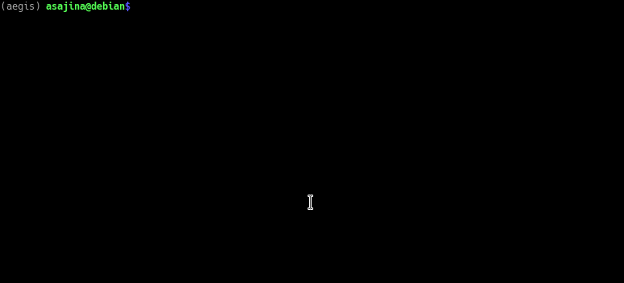

# AEGIS
> Ageing of Evolving Genomes In Silico

A highly versatile discrete numerical model of genome evolution - both sexual and asexual - for a population of agents whose fitness parameters are encoded age-specifically in bit arrays which are free to evolve due to mutation and recombination.

This is a software implementation of the model described in this [article](https://www.biorxiv.org/content/early/2016/01/26/037952) in section "The Model".

## Who uses AEGIS?
* [Valenzano Lab](http://valenzano-lab.age.mpg.de/)

## Features


AEGIS can:
* run sexual and asexual simulations with randomly generated populations or populations obtained from a previous simulation
* output simulation objects using [pickle](https://docs.python.org/2/library/pickle.html)
* output recorded statistics to a [csv](https://en.wikipedia.org/wiki/Comma-separated_values)
* generate figures from recorded statistics
* determine when a population has reached evolutionary equilibrium (i.e. the genetic constitution is not expected to change anymore) (for details see here: **TODO** explain autostage)

### Installation
```shell
pip install aegis
```

### Usage

The *configuration file* is instrumental to running simulations with aegis.
You would copy a default configuration file to `config.py` in your cwd like so:
```shell
aegis get ./config.py
```
This file defines *all* simulation parameters. Inspect it and read the comments for each parameter. Edit the parameters as desired with your favorite text editor and then run the simulation:
```shell
vim config.py
aegis run config.py
```
You will see informative output being written in the standard output as the
simulation progresses and will be informed when the simulation has completed. In the config file, you had to designate the prefix of the output directory; say `mysim`,
then your files will be saved (dumped by [pickle](https://docs.python.org/2/library/pickle.html)) in  `./mysim_files`.

To extract basic information from the Record file to a csv and to generate figures you would do:
```shell
aegis read --csv ./mysim_files/records/run0.rec
aegis plot mysim_csv_files
```
This will create a directory *mysim_csv_files* containing csv files extracted from the Record file and will then create a directory *mysim_plots* containing plots generated from the csv files. A similar session would look like this:


#### Examples
Following are examples of configuration files for different simulation scenarios with
descriptions. See that you can derive the *description* from the respecting
*configuration file*.

##### Scenario 1
[config1.py](./readme_metadata/config1.py)

**Description:**
This simulation is asexual and the starting resources are set to 1000. The resources remain constant throughout the simulation. The starting population size is 500. The simulation consists of 1 run that is 1000 stages long. The run will be recorded at 5 snapshot stages. We haven't provided a seed Population, therefore a new one will be randonmly generated. At simulation completion only the record for the one run will be
saved in `./scen1_files/records/run0.rec`.

##### Scenario 2
[config2.py](./readme_metadata/config2.py)

**Description:**
Same as Scenario 1, but we have 2 runs, at simulation completion we save records
and final populations and the number of stages per run is set automatically.
Saved files are:
* `./scen2_files/records/run0.rec`
* `./scen2_files/records/run1.rec`
* `./scen2_files/populations/run0.pop`
* `./scen2_files/populations/run1.pop`

##### Scenario 3
[config3.py](./readme_metadata/config3.py)

**Description:**
Say we copied the population from the first run in Scenario 2 to a file in our
cwd named `scen2_run0.pop`. We want to see how this population will change
if set the resources to 500 instead of previous 1000.
This simulation has 1 run with `scen2_run0.pop` as seed and resources are set to 500. The remaining parameters are same as in Scenario 2. We changed the output prefix to be "scen2_run0_continue".

##### Scenario 4
[config4.py](./readme_metadata/config4.py)

**Description:**
Same as Scenario 2, but the simulation is sexual, we record the runs at 20
snapshots, resources are set to 10000 and starting population to 5000.
Also, in order to keep the record file size smaller, we only record age
distribution for 100 generations around snapshots.

##### Scenario 5
[config5.py](./readme_metadata/config5.py)

**Description:**
Say we do want to have the complete age distribution data for our Scenario 5 run
after all. We can retrieve the pseude-random number generator (*prng*) used to 
produce that run and reproduce it. To get the prng:
```bash
aegis get -rseed ./scen4_files/records/run0.rec ./scen4.prng_seed
```
We now only need to pass the path to aegis in the config file and set age 
distribution to be recorded at every stage.

##### Scenario 6
[config6.py](./readme_metadata/config6.py)

**Description:**
Say that we, for some reason, want to have a simulation like the one in Scenario 4
in which the population dies off after 1000 generations. We would modify the
*starve_at* parameter in the config file accordingly.
We will set output prefix to "scen4_dieoff".

#### Advanced usage
If you wish to do analysis on simulation data that goes beyond this basic functionality, we recommend you to get familiar with the Record object. Loading the Record file with *pickle* leaves you with a python dictionary to inspect. In it, the recorded statistics are saved in [numpy](http://www.numpy.org/) arrays. You can obtain a csv listing of all Record entries with basic information via:
```shell
aegis read -i ./sim1_files/records/run0.rec my_rec_info.csv
```
It is worth noting that runtime and memory needed increase with population and genome size. Also, sexual simulations can be considerably more costly in this respect due to additional computations involved (recombination and assortment).

When running simulations until they reach evolutionary equilibrium (i.e. setting *n_stages = "auto"* in the config file), the runtime, depending also on population and genome size, is hard to estimate. Getting a sense for runtime by trial and by keeping log files might become necessary in some cases since the maximal number of stages allowed has to be defined a priori in the config file for computational reasons. When the maximal number of stages allowed is reached, the simulation will terminate irrespective of whether it has reached evolutionary equilibrium or not. If you have questions concerning this, don't hesitate to contact us.

**TODO** keep coonfig file - in detail here or move somewhere else?
#### Config file - in detail
| Parameter     	| Possible values | Explanation |
| ----------------- |:-----------:|:---------------:|
| random_seed 		| numeric or path to file (string) | seed for pseudo-random number generator |
| n_runs 			| int | number of runs |
| n_stages 			| int or "auto" | if int then number of stages to run, else if "auto" then run until population reaches evolutionary equilibrium |
| n_snapshots 		| int | number of w.r.t. n_stages uniformly distributed snapshots at which to record detailed population statistics |
| path_to_seed_file | path to file (string) | path to Population file to use as seed, if none then "" (empty string) |
| max_fail 			| int | maximum number of tolerated extinctions for each run before terminating |
| output_prefix 	| string | prefix for output files |
| output_mode 		| 0,1 or 2 | 0: output records only, 1: output records and final populations, 3: output records and all population snapshots |
| age_dist_N 		| int or "all" | if int size of window around snapshots for which to record age distribution, else if "all" then records age distribution at all stages |
| repr_mode 		| "sexual","asexual","assort_only" or "recombine_only" | / |
| res_start 		| int | initial amount of resources available |
| start_pop 		| int | initial population size |
| res_function 		| [lambda function](https://www.programiz.com/python-programming/anonymous-function) | function for updating resources |
| stv_function 		| lambda function | function for identifying starvation |
| pen_cuml 			| True or False | defines whether penalization under starvation is cumulative over multiple stages |
| surv_pen_func 	| lambda function | function for penalizing survival |
| repr_pen_func 	| lambda function | function for penalizing reproduction |
| deltabar 			| float | relative error allowed for the deviation from stationary distribution |
| scale 			| float | scaling factor applied to target generation estimated for deltabar |
|max_stages 		| int | maximum number of stages to run before terminating |
| surv_bound 		| [float x, float y] | minimal and maximal survival rates |
| repr_bound 		| [float x, float y] | minimal and maximal reproduction rates |
| r_rate 			| float | rate of recombination sites |
| m_rate 			| float | mutation rate |
| m_ratio 			| float | ratio of benevolent (zero to one) to detrimental (one to zero) mutations |
| g_dist 			| {"s": float x, "r": float y, "n": float z} | proportion of ones when initializing the genomes at random for survival, reproduction and neutral loci respectively |
| n_neutral 		| int | number of neutral loci |
| n_base 			| int | number of bits per locus on one chromosome |
| max_ls 			| int | maximum lifespan |
| maturity 			| int | age at which an agent can reproduce |

## Contributing
If you'd like to contribute, please fork the repository and use a feature
branch. Pull requests are warmly welcome.

### Conventions
Here is a *tree* listing of the relevant files:
```shell
.
|-- README.md
|-- setup.py
|-- bin
|   `-- aegis
|-- aegis
|   |-- Core
|   |   |-- functions.py
|   |   |-- config_default.py
|   |   |-- Config.py
|   |   |-- Population.py
|   |   |-- Record.py
|   |   |-- Plotter.py
|   |   |-- Run.py
|   |   |-- Simulation.py
|   |   |-- Plotter.py
|   |   |-- Test
|   |   |   |-- tconfig.py
|   |   |   |-- test_0_functions.py
|   |   |   |-- test_1_Config.py
|   |   |   |-- test_2a_Population_init.py
|   |   |   |-- test_2b_Population_minor.py
|   |   |   |-- test_2c_Population_major.py
|   |   |   |-- test_3_Record.py
|   |   |   |-- test_4_Run.py
|   |   |   |-- test_5_Simulation.py
|   |   |   |-- test_6_Plotter.py
|   |   |   |-- test_7_Autostage.py
|   |   |-- __init__.py
|   |-- __init__.py
```

The code was written with future modular development in mind so that different biological questions can be addressed with specific modules. New modules should be appropriate modifications of the *Core* module.

The code is organized in Classes and files by its function:
* **functions.py** contain functions for initializing objects
* **config_default.py** is where simulation parameters are defined
* **Config** derives further simulation variables from the parameters defined in the config file
* **Population** holds ages, genomes and methods for their evolution through simulation time
* **Record** holds methods for recording *Population* statistics
* both *Population* and *Record* inherit *Config*
* **Run** is a wrapper for *Population* and *Record* and handles simulation progress through time
* **Simulation** is a wrapper for multiple *Runs*
* **Plotter** contains [seaborn](https://seaborn.pydata.org/) functions to generate plots from the csv files

We use [pytest](https://docs.pytest.org/en/latest/) for testing.

As for Git workflow, we try to follow this [branching model](https://datasift.github.io/gitflow/IntroducingGitFlow.html).

## Articles
* [An In Silico Model to Simulate the Evolution of Biological Aging](https://www.biorxiv.org/content/early/2016/01/26/037952)

## Team
* **Arian Šajina**     (arian.sajina@gmail.com)
* **William Bradshaw**  (William.Bradshaw@age.mpg.de)
* **Dario Valenzano**   (Dario.Valenzano@age.mpg.de)

## Licensing
This project is licensed under MIT license.

## Acknowledgments
This project is developed in the [Valenzano Lab](http://valenzano-lab.age.mpg.de) of
the [Max Planck Institute for Biology of Ageing, Cologne](https://www.age.mpg.de).
We thank all the lab members and friends of the lab for their constructive
comments and suggestions.
