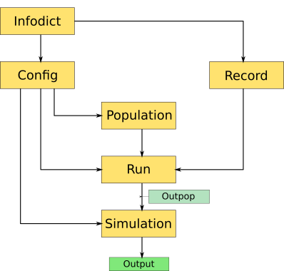

**TODO** We need a cool logo!

# AEGIS
> Ageing of Evolving Genomes In Silico

A highly versatile numerical model of genome evolution - both sexual and asexual - 
for a population of agents whose fitness parameters are encoded in bit arrays
which are free to evolve due to mutation and recombination.

## Installation

### currently
First clone the repo and run the tests:
```bash
git clone git@bitbucket.org:willbradshaw/genome-simulation.git
python setup.py test
```
If all tests pass, install aegis via pip in editable mode:
```bash
pip install -e .
```

### once project on PyPI
```bash
pip install aegis
```

## Developing
To be able to inspect, edit or expand the code, do the following:

```bash
git clone git@bitbucket.org:willbradshaw/genome-simulation.git
python setup.py test
pip install -e .
```

### Contributing
If you'd like to contribute, please fork the repository and use a feature
branch. Pull requests are warmly welcome.

### Conventions
If you wish to expand the model's functionality, make a copy of the Core module,
rename it and edit as desired.
Sticking to this modular practice allows us to add modules with which we can
investigate different questions of evolutionary biology without sacrificing
functionality attained so far.

Other practices we work by:

* [GitFlow](https://datasift.github.io/gitflow/IntroducingGitFlow.html)
* [Git housekeeping](https://railsware.com/blog/2014/08/11/git-housekeeping-tutorial-clean-up-outdated-branches-in-local-and-remote-repositories/")
* [pytest testing](https://docs.pytest.org/en/latest/)

#### Helpful material for developing
This is a schematic representation of aegis class hierarchy in the Core module:



**TODO** expand this

## Features
It is highly advised to read **this publication** to better understand both the 
conceptual and the practical aspect of the model.

(**TODO** link **this publication** to publication explaining the model)

For a quick dive into the usage of aegis reading this README and inspecting the 
*configuration file* (see below) should suffice.

## Usage
This is the help output of aegis:
```
usage: aegis [-h] [-m <str>] [-v] [-r <int>] [-p <str>] [-ws <int>]
             [-rseed <str>] [-recinfo <str>]
             script infile

Run the genome ageing simulation.

positional arguments:
  script                AEGIS script to run:
                            run - run the simulation with the config file specified in
                                  infile
                            plot - plot data from record object specified in infile
                            get - copies an aegis file in option to infile (config by default)
  infile                path to input config file

optional arguments:
  -h, --help            show this help message and exit
  -m <str>, --module <str>
                        AEGIS module to use for simulation run (default: 'Core')
  -v, --verbose         display full information at each report stage
                            (default: only starting population)
  -r <int>              report information every <int> stages (default: 100)
  -p <str>, --profile <str>
                        profile genome simulation with cProfile and save to given path
  -ws <int>, --window-size <int>
                        if called with plot, generates n1 plots with desired window size
  -rseed <str>, --random-seed <str>
                        if called with get, gets random seed from record file
  -recinfo <str>, --record-info <str>
                        if called with get, gets information on record file
```
The *configuration file* is instrumental to running simulations with aegis.
You would copy a default configuration file to `my_config.py` in your cwd like so:
```bash
aegis get ./my_config.py
```
This file defines *all* simulation parameters. Edit the parameter values as desired
with your favorite text editor and then run the simulation:
```bash
vim my_config.py
aegis run my_config.py
```
You will see informative output being written in the standard output as the
simulation progresses and will be informed when the simulation has completed.

If you wished to see full information displayed every 20 stages you would have
written:
```bash
aegis run my_config.py -v -r 20
```
Once simulation has finished, a directory will have been written in your cwd.
In `my_config.py` you had to designate what files will be saved at completion.
This could have been:

* 0: records only
* 1: records and final populations
* 2: records and final populations and all snapshot populations

Also you had to designate the prefix of the output directory; say `sim1`,
then your files are saved in  `./sim1_files`.

To plot the data from the first run you would do:
```bash
aegis plot sim1_files/records/run0.rec
```
The plots are saved in `./sim1_plots`.

### Examples
Following are examples of configuration files for different simulation scenarios with
descriptions. See that you can derive the *description* from the respecting
*configuration file*.

#### Scenario 1
[config1.py](./readme_metadata/config1.py)

**Description:**
This simulation is asexual and the resources are set to 1000.
The starting population size is 500. The simulation consists of 1 run that 
is 1000 stages long. The run will be recorded at 5 snapshot stages. We 
haven't provided a seed Population, therefore a new one will be generated for
us. At simulation completion only the record for the one run will be
saved in `./scen1_files/records/run0.rec`.

#### Scenario 2
[config2.py](./readme_metadata/config2.py)

**Description:**
Same as Scenario 1, but we have 2 runs, at simulation completion we save records
and final populations and the number of stages per run is set automatically.
Saved files are:
* `./scen2_files/records/run0.rec`
* `./scen2_files/records/run1.rec`
* `./scen2_files/populations/run0.pop`
* `./scen2_files/populations/run1.pop`

#### Scenario 3
[config3.py](./readme_metadata/config3.py)

**Description:**
Say we copied the population from the first run in Scenario 2 to a file in our
cwd named `scen2_run0.pop`. We want to see how this population will change
if set the resources to 500 instead of previous 1000.
This simulation has 1 run with `scen2_run0.pop` as seed and resources are set to 
500. The remaining parameters are same as in Scenario 2.
We changed the output prefix to be "scen2_run0_continue".

#### Scenario 4
[config4.py](./readme_metadata/config4.py)

**Description:**
Same as Scenario 2, but the simulation is sexual, we record the runs at 20
snapshots, resources are set at 10000 and starting population at 5000.
Also in order to keep the record file size smaller, we will only record age
distribution for 100 generations around snapshots.

#### Scenario 5
[config5.py](./readme_metadata/config5.py)

**Description:**
Say we do want to have the complete age distribution data for our Scenario 5 run
after all. We can retrieve the pseude-random number generator (*prng*) used to 
produce that run and reproduce it. To get the prng:
```bash
aegis get -rseed ./scen4_files/records/run0.rec ./scen4_prng_seed
```
We now only need to pass the path to aegis in the config file and set age 
distribution to be recorded at every stage.

#### Scenario 6
[config6.py](./readme_metadata/config6.py)

**Description:**
Say that we for some reason, want to have a simulation like the one in Scenario 4
in which the population dies off after 1000 generations. We would modify the
*starve_at* parameter in the config file accordingly.
We will set output prefix to "scen4_dieoff".

## Related publications
[An In Silico Model to Simulate the Evolution of Biological Aging](https://www.biorxiv.org/content/early/2016/01/26/037952)

## Team
* Dario Valenzano   Dario.Valenzano@age.mpg.de
* William Bradshaw  William.Bradshaw@age.mpg.de
* Arian Šajina      Arian.Sajina@age.mpg.de

## Licensing
The code in this project is licensed under MIT license.

## Acknowledgments
This project is developed in the [Valenzano Lab](http://valenzano-lab.age.mpg.de) of
the [Max Planck Institute for Biology of Ageing, Cologne](https://www.age.mpg.de).
We thank all the lab members and friends of the lab for their constructive
comments and suggestions.
