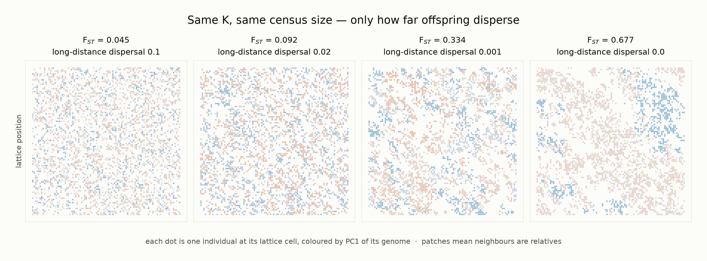

# Is it carrying capacity or Ne? — what we ran, and what came out

**Figures:** `runs/spatial_structure.png` · `runs/routes_decomposition.png` · `runs/killifish_windows.png`
**Code and full record:** `experiments/ne_lifespan/` (branch `exp-ne-lifespan`), details in `HANDOFF.md`

---

## 1. Your question was right, and it was a real problem

You pointed out that in the existing sweep, "Ne" is set by `RESOURCE_MAXIMUM_AMOUNT` — the
carrying capacity. That is literally true: the config file says `# Ne is set by the resource
limit`, and `build()` sets `INITIAL_POPULATION_SIZE = RESOURCE_MAXIMUM_AMOUNT =
RESOURCE_ADDITIVE_GROWTH = ne`. So the sweep never varied Ne independently of K, and there was
no measurement of Ne to appeal to.

Your proposed fix was to decouple the variables using N·u. One relabelling was needed —
**N·u and Ne are different quantities.** N·u is the *supply* of new variants; Ne is
*selectability*, whether selection can resolve a variant at all (|s| vs 1/2Ne). Changing µ does
not change Ne, so "vary µ to vary Ne" varies supply, not drift.

But the manipulation you proposed was worth running on its own terms — and when we ran it
(route 2 below) **it produced the largest effect of the three.** You proposed the right
experiment; it was measuring a different thing than the label suggested, and that thing turned
out to matter most.

The instinct — that the variables had to be pulled apart — was exactly right, and it turns out K
reaches life history by **three** distinct paths, not two:

| | route | what it changes |
|---|---|---|
| **1** | K → N → **Ne** | the drift barrier: can selection *see* a late-acting variant? |
| **2** | K → **N·u** | mutational supply: how much raw material arrives? |
| **3** | K → resource-limited **mortality** | Williams/Medawar: how steep is the selection gradient? |

The original design moved all three at once. The measured effect was their sum.

---

## 2. What we built

The hard part is varying Ne while holding K fixed. In a well-mixed AEGIS population that is
impossible: offspring number is drawn from a binomial, which cannot be overdispersed, so Ne is
pinned within about 2× of census N.

**Spatial structure breaks that.** With `LATTICE_MODE`, mating and offspring placement are
local, so drift is governed by neighbourhood size rather than global census — which can sit far
below N. That is population fragmentation, and it is also biologically the right model for
killifish pools.

We calibrated it first rather than assuming (12 short runs): `MIGRATION_LONG_RATE` turned out to
be the strong knob, mapping onto spatial structure F_ST over a **15× range** while census N held
at exactly 3000 in every arm.

That figure is what F_ST is measuring. Each dot is one individual at its lattice cell, coloured
by PC1 of its genome — the same axis a PCA of real genomes would show. On the left, offspring
disperse far and the genome is spatial noise. On the right they don't, neighbours are relatives,
and the population breaks into patches. **Carrying capacity, census size and total mutational
input are identical across all four panels.** The only difference is how far offspring travel.

Then: **one** pre-evolved ancestor (430,000 steps, equilibrated on the neutral locus), branched
into every treatment. Because all arms share that ancestor, nothing downstream can be burn-in
history. Three seeds throughout.

---

## 3. Result — all three routes are real

Against the control (evolved lifespan **20.78 ± 0.16**):

| route | manipulation | Δ lifespan | Δ early survival | Δ late survival | late/early |
|---|---|--:|--:|--:|--:|
| 1 drift barrier | F_ST 0.09 → 0.68 | −2.28 | −0.0055 | −0.0261 | 4.7× |
| 2 mutational supply | µ × 4 | −6.05 | −0.0262 | −0.1003 | 3.8× |
| 3 extrinsic mortality | starvation deaths | −4.38 | −0.0118 | −0.1236 | 10.5× |

**The answer to your question is not "Ne" and not "K" — it is that K acts through three paths and
all three carry real signal.** You were right that the original result was confounded.

What survives for the Ne position, and it is the new thing here: **route 1 shows Ne alone**, at
identical K, identical census N and identical N·u, producing a monotone dose–response with
**r = −0.998** across a 7× range of structure, with erosion concentrated at late ages exactly as
the drift barrier predicts. No comparative dataset can isolate that — it needs an experiment.

Two things worth knowing about the comparison:

- **The ranges are not commensurable.** We moved F_ST 7.5× and µ 8×. Which matters more *in
  nature* depends on which varies more between real populations — and fragmentation varies
  enormously between killifish pools, while germline µ is comparatively conserved within a
  species. Route 2 having the larger per-knob effect does not make it the ecologically dominant
  path.
- **The late/early ratio is a second discriminator.** Supply is the most uniform (3.8×) because
  extra mutations arrive at every age; extrinsic mortality is the most late-concentrated (10.5×)
  because it acts directly on the selection gradient. That gives a way to tell mechanisms apart
  in real data independently of effect size.

---

## 4. Second experiment — annual killifish and the water window

Dario's scenario: killifish live about as long as their pool holds water, while time to maturity
is conserved. Explanation to test — a long-lived ancestor colonises faster-drying pools, and
mutations affecting survival *beyond* the water window accumulate because selection cannot see
past it.

Same ancestor, plus a periodic total dry-down that kills every fish but spares the diapausing
egg bank. Windows of 12/18/24/30 steps (2–5× age at maturity), each run with two generation
structures.

**With synchronous annual cohorts, evolved lifespan tracks the window almost one-for-one:**

| window | 12 | 18 | 24 | 30 |
|---|--:|--:|--:|--:|
| evolved lifespan | 13.0 | 17.2 | 20.3 | 21.6 |

saturating once the window exceeds what the ancestor had anyway (20.9). The survival curve shows
a **knee at exactly the window** in every arm — flat before it, collapsed after.

**With overlapping generations it does not.** Those arms degrade early regardless of the window
(lifespans 12.6 / 12.0 / 13.8 / 14.7 — barely moving). The reason is survivorship shape: with a
synchronous cohort *everyone* reaches the window, so the horizon is a hard step; with continuous
hatching an individual born late reaches only a young age, so selection weakens gradually from
birth.

**So the egg bank is not incidental — it is the mechanism that makes lifespan track water
sharply.** Comparative prediction: non-annual congeners in the same pools should show shorter,
less tightly coupled lifespans.

---

## 5. The distinction this forces: global Ne vs local Ne

This is the part most worth carrying beyond the simulation.

**"Ne" is not one number.** Under spatial structure there are at least two, and under
fragmentation they move in **opposite directions**:

| | what it governs | under fragmentation |
|---|---|---|
| **global Ne** | total genetic diversity across the whole population | **rises** — subdivision preserves variants by holding them in different patches (Wahlund); `Ne_global ≈ N/(1−F_ST)` |
| **local Ne** | whether selection can resolve a variant among the individuals actually competing | **falls** — the neighbourhood is small |

Selection efficiency depends on the **local** one. Diversity-based estimators measure the
**global** one.

Our runs show the divergence directly. Across the fragmentation gradient, genome-wide genetic
Ne rose from ~182 to ~266 while evolved lifespan fell from 20.99 to 18.49. More structure meant
**more retained diversity and worse selection at the same time.**

⚠️ Caveat on those particular numbers: the Ne values come from the short calibration runs
(5,000 steps, still far from mutation–drift equilibrium) and the lifespans from the 200,000-step
route-1 arms. Same F_ST grid, different runs — so treat the table as indicative of direction, not
as a within-run measurement. Measuring global Ne inside the route-1 arms themselves is one rsync
away and worth doing before this is used in an argument.

### Why it matters outside the simulation

1. **It can invert an inference from real genomes.** Estimating Ne from genome-wide diversity
   (θ_w, π, the SFS) gives the *global* number. In a structured species that estimate can go
   **up** exactly when selection efficiency goes **down**. Anyone concluding "diversity is high,
   so selection is efficient" in a fragmented population may have it backwards. Killifish pools
   are about as structured as natural populations get — so whether a diversity estimate was
   computed within pools or pooled across them is not a detail, it decides the sign.

2. **The theory needs to say which Ne.** Lehtonen's drift barrier and Aubier & Galipaud's
   extension both write a single `Ne` into `1/(2Ne)`. It has to be the local one. That is a
   genuine refinement rather than a quibble, because the two can move oppositely.

3. **It predicts a signature that looks contradictory under a one-Ne model:** high genome-wide
   diversity together with high mutation load, in the same population. Under a single Ne those
   should be anti-correlated. Under structure they are not — and the combination is diagnostic of
   fragmentation specifically.

4. **It is why we could not use the standard tool.** `runs/genetic_ne.py`, applied to a global
   sample of the fragmented arms, would have reported "Ne went *up*, so the drift-barrier story
   is wrong" — a confident, wrong conclusion from an arithmetically correct calculation of the
   wrong quantity. That is documented in `HANDOFF.md` as a trap, not a footnote.

### Migration is what makes a "global" population exist at all

Converting F_ST into **migrants per generation** — the quantity that decides whether patches are
one population or many — `Nm = (1 − F_ST) / (4 F_ST)`:

| arm | F_ST | **Nm** | Δ lifespan |
|---|--:|--:|--:|
| A_ld0200 | 0.092 | 2.47 | +0.21 |
| A_ld0050 | 0.172 | 1.20 | +0.00 |
| A_ld0010 | 0.334 | 0.50 | −0.71 |
| A_ld0000 | 0.677 | 0.12 | −2.29 |

**The lifespan effect switches on exactly where Nm crosses 1** — Wright's classic
one-migrant-per-generation threshold, the line between "one population" and "many", showing up
in an ageing phenotype. Above it, nothing; below it, the effect appears and grows fourfold.

And this is why the global number stops being meaningful. `Ne_global ≈ N/(1−F_ST)` gives 3,304 at
F_ST 0.09, 9,288 at 0.68, and **diverges to infinity** as F_ST → 1. That divergence is the formula
announcing that its object has ceased to exist: with no migration there is no global population,
only independent lineages, and pooling them yields a statistic about a sample rather than the
effective size of anything evolving.

So global Ne is not a property of a set of organisms. It is a property of a set of organisms
**plus enough migration to bind them into one evolutionary unit**. Which gives a useful paradox:

> the global/local distinction matters **least** where the global number is well defined, and
> **most** where it barely means anything.

At Nm ≫ 1 the two coincide and one number suffices. At Nm ≪ 1 they diverge — but the global one
is then describing a fiction. The interesting band is Nm ≈ 1, where both are meaningful *and*
different. That is where our effect turns on, and plausibly where fragmented killifish pools sit.

⚠️ The Nm values invert the *island* model (`F_ST ≈ 1/(1+4Nm)`) while our lattice is a
stepping-stone, so the ordering is robust but the absolute values are approximate — the apparent
coincidence with exactly 1 is suggestive, not measured. Countable directly from the lattice
snapshots if it matters.

---

## 6. Where this sits in the literature

Worth knowing before writing anything up: **Ne → lifespan is not untouched ground.**

- **Lohr, David & Haag (2014)** *Evolution* — empirical, *Daphnia magna* across pond sizes; reduced
  lifespan and accelerated ageing in small populations, attributed to drift rather than adaptation.
  Five years *before* Cui et al. 2019.
- **Lehtonen (2020)** *Evolution Letters* — the analytical drift-barrier theory, giving maximum
  lifespan ≈ b + ln(Ne)/(σf).
- **Aubier & Galipaud (2024)** *Evolution Letters* — extends it, and proposes a *competing*
  mechanism where senescence ratchets earlier without Ne changing at all.

What is not in that literature: an experimental decomposition holding K, N and N·u fixed. That is
what route 1 provides, and it is also a direct test of Lehtonen's ln(Ne) law by an independent
method.

---

## 7. Caveats

- Three seeds, one genetic architecture, `AGE_LIMIT = 30`.
- Seeds 2 and 3 branched at 2.5% / 2.9% of the neutral gap remaining rather than <1%. Within-seed
  contrasts are unaffected (all arms of a seed share one ancestor); seed 1 is clean as a reference.
- The overlapping killifish arms vary in population size across windows (979–1698), so their
  effect sizes carry an Ne confound. The annual arms do not — N is 1509–1570 across all windows,
  a 4% spread against an 8.6-unit lifespan effect.
- Route 3's arm had to be run twice: the first version silently applied no mortality at all
  (`STARVATION_PENALTY` was 0, which nulls the penalty entirely). Worth knowing as a general
  warning — it exited cleanly and produced a plausible three-seed result.

---

## 8. What's open — and it's yours

The reproductive axis. Every result above is **survival**; reproduction was locked
(`G_repr_evolvable = False`) throughout.

That axis is where the literature is thinnest. Lehtonen and Aubier & Galipaud both model
*mortality*; Lohr measured *lifespan*; Cui and Willemsen measured lifespan and mutation load.
**None of them treat fecundity.** And Hamilton's selection gradients differ between survival and
fertility — the two kernels have different age weightings — so there is no reason they should
erode at the same rate under drift. Whether they do is open, testable, and needs a system where
the genetic architecture is visible.

Practical notes for that experiment: `G_repr_evolvable` and `G_repr_agespecific` are *structural*
parameters, so it needs its own burn-in and cannot branch off the current ancestor. Turning
reproduction on also needs lo/hi pre-compensation (`G_repr_lo: 0, G_repr_hi: 0.7071`) — see
`HANDOFF.md`. The three-route design transfers to it directly.
